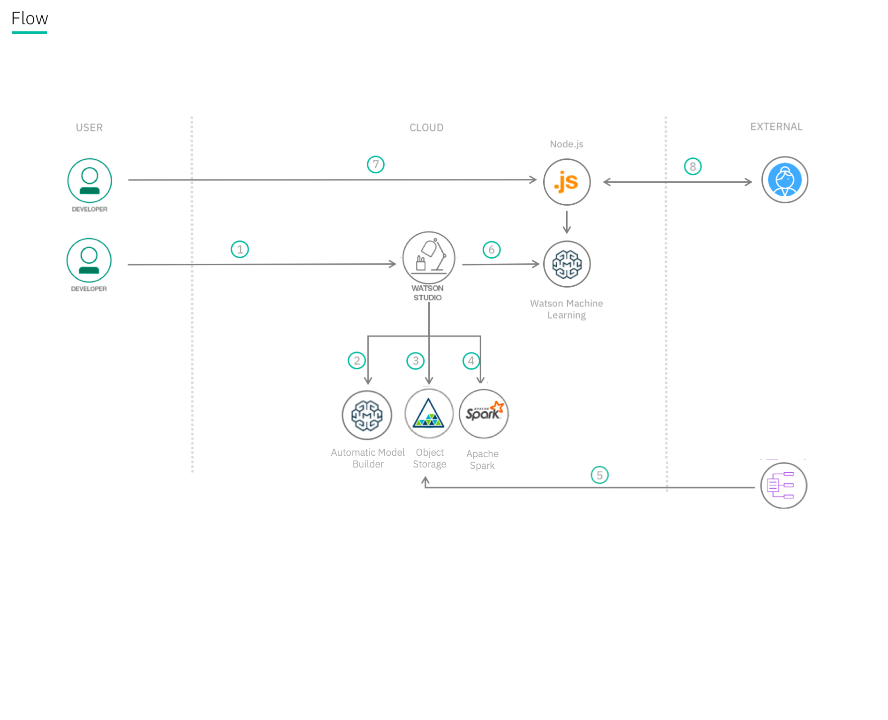

DISCLAIMER: This application is used for demonstrative and illustrative purposes only and does not constitute an offering that has gone through regulatory review.

#  Create and deploy a scoring model to predict heart failure on IBM Cloud with Watson Studio

In this Code Pattern, we will use the Automatic Model Builder on Watson Studio to build a predictive model that demonstrates a potential health care use case.

When the reader has completed this Code Pattern, they will understand how to:

* Build a predictive model using the Watson Automatic Model Builder
* Deploy the model to IBM's Watson Machine Learning service
* Access the Machine Learning model via either APIs or a Node.js app

## Flow
1. The developer creates a Watson Studio Service
2. Use the Automatic Model Builder to build, train, and evaluate a model; part of the Watson Machine Learning Service
3. Watson Studio uses Cloud Object storage to manage your data and project files 
4. Watson Machine Learning Service depends on an Apache Spark service for model training
5. Import data on heart failure
6. Trained models are deployed into production using Watson Machine Learning Service
7. A Node.js web app is deployed on IBM Cloud calling the predictive model hosted in the Watson Machine Learning Service
8. A user visits the web app, enters their information, and the predictive model returns a response

## Included components
* [Watson Studio](https://www.ibm.com/cloud/watson-studio): Analyze data using RStudio, Jupyter, and Python in a configured, collaborative environment that includes IBM value-adds, such as managed Spark.

## Featured technologies
* [Artificial Intelligence](https://medium.com/ibm-data-science-experience): Artificial intelligence can be applied to disparate solution spaces to deliver disruptive technologies.
* [Data Science](https://medium.com/ibm-data-science-experience/): Systems and scientific methods to analyze structured and unstructured data in order to extract knowledge and insights.
* [Node.js](https://nodejs.org/): An open-source JavaScript run-time environment for executing server-side JavaScript code.

# Steps
1. [Create an instance of the Watson Studio Service](#1-create-an-instance-of-the-watson-studio-service)
2. [Welcome to Watson Studio](#2-welcome-to-watson-studio)
3. [Create an instance of the Watson Machine Learning Service](#3-create-an-instance-of-the-watson-machine-learning-service)
3. [Create a project in Watson Studio and bind it to your Watson Machine Learning service instance](#3-create-a-project-in-watson-studio-and-bind-it-to-your-watson-machine-learning-service-instance)
4. [Save the credentials for your Watson Machine Learning Service](#4-save-the-credentials-for-your-watson-machine-learning-service)
5. [Upload and explore data](#5-upload-and-explore-data)
6. [Train a Machine Learning model](#6-train-a-machine-learning-model)
7. [Deploy the saved predictive model as a scoring service](#7-deploy-the-saved-predictive-model-as-a-scoring-service)
8. [Deploy the testing application](#8-deploy-the-testing-application)

## Prerequisites

* An [IBM Cloud Account](https://console.bluemix.net)

* A space in IBM Cloud US South or United Kingdom regions.

As of 2/5/2018, the Machine Learning service on IBM Cloud is only available in the US South or United Kingdom regions.

### 1. Create an instance of the Watson Studio Service
Watson Studio is your IDE for Machine Learning and Data Science, combining opensource tools, and libraries into a unified Cloud based platform for discovering and sharing insights. For this lab we're using the Automatic Model Builder simplifying the data preparation, training, and evaluation steps of machine learning. 

* In your browser go to the [IBM Cloud Dashboard](https://console.bluemix.net/dashboard/apps) and click `Catalog`. 

* In the navigation menu at the left, select `AI` and then select `Watson Studio`.

  

* Verify this service is being created in the Dallas region, and you've selected the lite/free pricing plan. Note the lite/free plan only allows you to add a single user to your project, and is limited in the compute capacity hours.  More details on limites and to monitor usage is available in the (documentation)[https://dataplatform.cloud.ibm.com/docs/content/admin/monitor-resources.html?context=analytics&linkInPage=true}.

  

* Click `Create`

* Launch your newly created Watson Studio Environment

  
 
 
  
  
### 2. Welcome to Watson Studio

IBM Watson Studio is a collaborative environment with AI tools that you and your team can use to collect and prepare training data, and to design, train, and deploy machine learning models.

Ranging from graphical tools you can use to build a model in minutes, to tools that automate running thousands of experiment training runs and hyperparameter optimization, Watson Studio AI tools support popular frameworks, including: TensorFlow, Caffe, PyTorch, and Keras.

You can think of Watson Studio AI tools in four categories:

* Visual recognition
* Natural language classification
* Machine learning
* Deep learning

Documentation is available (here)[https://dataplatform.cloud.ibm.com/docs/content/getting-started/welcome-main.html?context=analytics]

#### Overview Landing Page

  
  
   1. Projects - Organize resources used when working with data; here you see your most recently updated projects
   2. Toos - Quick links to commonly used Data Science and ML Tools including RStudio, Data Refinery, Jupyter Notebooks, or a Visual Neturl Network Model Builder
   3. Catalog - Create and manage data policies for managed or connected data resources
   4. Community - Links to the best content found by IBM Data Scientists, including example notebooks, datasets, and tutorials
   5. Services - Create Watson, data, and compute services and connections. Such as Watson Visual Recognition, or Apache Spark 
   6. Manage - Account wide configuration, including Anaconda environments, security, catalogs, billing
   7. Hamburger Menu - Access to IBM Cloud dashboard and tools
   8. IBM Studio Menu - Quick link to the Watson Studio welcome page
   9. Account Profile and Settings - Personal account settings
  
  
  
  
  1.
  2.
  3.
  4.
  5.
  6.

### 2. Create an instance of the Watson Machine Learning Service

* In your browser go to the [IBM Cloud Dashboard](https://console.bluemix.net/dashboard/apps) and click `Catalog`.

* In the navigation menu at the left, select `AI` and then select `Machine Learning`.

  

* Verify this service is being created in the Dallas region.

  

* Click `Create`.

### 4. Create a project in IBM Data Science Experience and bind it to your Watson Machine Learning service instance

* In a new browser tab go to [https://datascience.ibm.com](https://datascience.ibm.com).

* Click on `Sign In` at the top of the page.

* From the dashboard, click on `New Project` from the dashboard.

  

* DSX projects depend on two services: Object Storage, and a Compute Engine.  If you don't already have Object Storage or a Compute Engine, you can create a new instance of each service while defining a new project.  The _New Project_ panel is easy to use, either select an existing service on the right, or create a new one.  In the example below services need to be created.

  

> Note: Services created must be in the same region, and space, as your Data Science Experience service.

* Enter _Watson ML Integration_ as the project name and click `Create`.

* From within the new project `Overview` panel, click `Add to project` on the top right, selecting `Data asset`.

  

  A panel on the right of the screen appears, select `load` and click on `Browse` to upload the data file you'll use to create a predictive model.

  

* On your machine, browse to the location of the file **patientdataV6.csv** in this repository in the **data/** directory. Select the file and click on Open (or the equivalent action for your operating system).

* Once successfully uploaded, the file should appear in the `Data Assets` section.

  

* Click on `Settings` for the project.

  

* Click on add associated service and select `Machine Learning`.

  

* Choose your existing Machine Learning instance and click on `Select`.

  

* The Watson Machine Learning service is now listed as one of your `Associated Services`.

  

* Leave the browser tab open for later.

### 5. Save the credentials for your Watson Machine Learning Service

* In a different browser tab go to [http://console.bluemix.net](http://console.bluemix.net) and log in to the Dashboard.

* Click on your Watson Machine Learning instance under `Services`.

  

* Click on `Service credentials` and then on `View credentials` to see the credentials.

  

* Save the username, password and instance_id to a text file on your machine. You’ll need this information later in your Jupyter notebook.

### 6. Upload and explore data
stuff

### 7. Train a Machine Learning model

* If you don't have your newly created Project open, first click `Projects` -> `View All Projects`, and then select your newly created project from Step 4. Next, in the Data Science Experience browser tab click on `Overview` and then click `add notebooks`.

  

* Click on `From URL` and name the notebook _Apache Spark integration with Watson ML_.

* Under `Notebook URL` provide the following url: https://github.com/IBM/predictive-model-on-watson-ml/blob/master/demo1.ipynb

  

* Click `Create Notebook` to create the new notebook.

### 7. Run the notebook in IBM Data Science Experience

* Place your cursor in the first code block in the notebook.

  

* Click on the `Find and Add` data icon -- see step 1 in diagram below -- and then select `Insert to code` under the file **patientdataV6.csv**. This is step 2 in diagram below. Finally select `Insert Spark Data Frame` -- which is step 3 in diagram below.

  

> Note:  Make sure to rename the variable to `df_data` and add `.option('inferSchema','True')\`.

  

* Click on the `Run` icon to run the code in the cell.

  

* Move your cursor to each code cell and run the code in it. Read the comments for each cell to understand what the code is doing. **Important** when the code in a cell is still running, the label to the left changes to **In [\*]**:.
  Do **not** continue to the next cell until the code is finished running.

* When you get to the cell that says `Stop here !!!!` insert the username and password that you saved from your Watson Machine Learning instance into the code before running it.

  

* Continue running each cell until you finish the entire notebook.

### 8. Deploy the saved predictive model as a scoring service

* In a different browser tab go to [http://console.bluemix.net](http://console.bluemix.net) and log in to your dashboard.

* Click on the entry for your Watson Machine Learning service under `Services`.

* Click `Manage` and then click on the `Launch Dashboard` button in the Watson Machine Learning tile.

* Your saved model should appear. Under `Actions` select `Create Deployment`.

* Name the deployment _Heart Failure Prediction Model Deployment_ and click `Save`. Keep the type of deployment set to the default value 'Online'.

* Your model should now be deployed and visible as a Deployment with status 'ACTIVE'.

* Restart the Node.js Web App. For this, return to your IBM Cloud Dashboard and select the restart icon to restart the web application.

### 1. Deploy the testing application

Use Ctrl-click on the Deploy to `IBM Cloud` button below to open the deployment process in a separate tab.

  

> Note:  Make sure to deploy the application to the same region and space as where the *Watson Studio*, *Apache Spark* and *Cloud Object Storage* services will be created. Please take note of this space as later in this lab the Watson Machine Learning service needs to be deployed into the same space.

* Click on `Deploy` to deploy the application.

  

* A Toolchain and Delivery Pipeline will be created for you to pull the app out of Github and deploy it in to IBM Cloud. Click on the Delivery Pipeline tile to see the status of the deployment.

  

* Wait for the **Deploy Stage** to complete successfully.

  

# Sample Output

* Click on the application URL to open the application in a separate tab.

* When the application appears click on `Score now` to test the scoring model with the default values.

* Verify that the model predicts that there is a risk of heart failure for the patient with these medical characteristics.

* `Click Close`. Run the app again with the following parameters.

* Verify that the model predicts that there is not a risk of heart failure for the patient with these medical characteristics.

# Troubleshooting

# Privacy Notice
If using the `Deploy to IBM Cloud` button some metrics are tracked, the following
information is sent to a [Deployment Tracker](https://github.com/IBM/cf-deployment-tracker-service) service
on each deployment:

* Node.js package version
* Node.js repository URL
* Application Name (`application_name`)
* Application GUID (`application_id`)
* Application instance index number (`instance_index`)
* Space ID (`space_id`)
* Application Version (`application_version`)
* Application URIs (`application_uris`)
* Labels of bound services
* Number of instances for each bound service and associated plan information

This data is collected from the `package.json` file in the sample application and the `VCAP_APPLICATION` and `VCAP_SERVICES` environment variables in IBM Cloud and other Cloud Foundry platforms. This data is used by IBM to track metrics around deployments of sample applications to IBM Cloud to measure the usefulness of our examples, so that we can continuously improve the content we offer to you. Only deployments of sample applications that include code to ping the Deployment Tracker service will be tracked.

## Disabling Deployment Tracking

To disable tracking, simply remove ``require("cf-deployment-tracker-client").track();`` from the ``app.js`` file in the top level directory.

# Links

* More data science journeys on IBM Code: [https://developer.ibm.com/code/journey/category/data-science/](https://developer.ibm.com/code/journey/category/data-science/)
* IBM Data Science Experience: [https://www.ibm.com/analytics/us/en/watson-data-platform/data-science-experience/](https://www.ibm.com/analytics/us/en/watson-data-platform/data-science-experience/)
* Watson Data Platform: [https://www.ibm.com/analytics/us/en/watson-data-platform/](https://www.ibm.com/analytics/us/en/watson-data-platform/)

# Learn more

* **Artificial Intelligence Code Patterns**: Enjoyed this Code Pattern? Check out our other [AI Code Patterns](https://developer.ibm.com/code/technologies/artificial-intelligence/).
* **Data Analytics Code Patterns**: Enjoyed this Code Pattern? Check out our other [Data Analytics Code Patterns](https://developer.ibm.com/code/technologies/data-science/)
* **AI and Data Code Pattern Playlist**: Bookmark our [playlist](https://www.youtube.com/playlist?list=PLzUbsvIyrNfknNewObx5N7uGZ5FKH0Fde) with all of our Code Pattern videos
* **With Watson**: Want to take your Watson app to the next level? Looking to utilize Watson Brand assets? [Join the With Watson program](https://www.ibm.com/watson/with-watson/) to leverage exclusive brand, marketing, and tech resources to amplify and accelerate your Watson embedded commercial solution.
* **Data Science Experience**: Master the art of data science with IBM's [Data Science Experience](https://datascience.ibm.com/)
* **Spark on IBM Cloud**: Need a Spark cluster? Create up to 30 Spark executors on IBM Cloud with our [Spark service](https://console.bluemix.net/catalog/services/apache-spark)

# License
[Apache 2.0](LICENSE)
